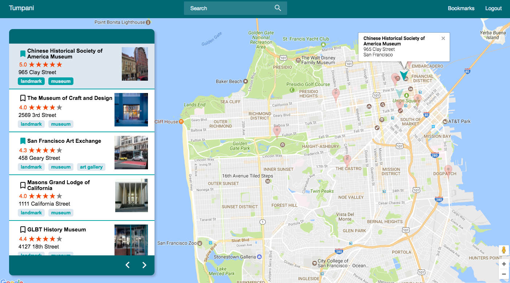

#Tumpani

[Tumpani live][tumpani]

Tumpani is a full-stack web application inspired by Yelp, with a TripAdvisor twist. It utilizes Ruby on Rails on the backend, a PostgreSQL database, and React.js with a Redux architectural framework on the frontend. The only external library used in the styling of this application, was [react-stars][react-stars].

For design documentation, see the [docs][docs].

## Features & Implementation

### Attractions

The attractions are the core of Tumpani. They are stored on the database in an `attractions` table, which contains columns for `id`, `place_id`, `name`, `street_address`, `city`, `rating`, `lat` (latitude) and `lng` (longitude). All this information, along with the `taggings` table ( relation between `attractions` and `tags`) was seeded using the [Google Places Api][google-places-api]. The `tags` table was seeded manually. To check the parsing algorithm for the seeds, please check the [seeds.rb][seeds] file.

The attractions can be fetched by a search in the `SearchBar` (by title or tag) , clicking any `Tag` in the home page, or clicking `Bookmark`, and getting the attractions that are bookmarked for the current user. These fetched attractions are saved as a list in the `state`, using the `id` of each one as the key.

The attractions are rendered in two different, independent `components`:

* `AttractionIndex`: This component is displayed after the user makes a search, either through the `SearchBar`, `Tags` or `Bookmark`. The small photo for each attraction is fetched from the [Google Places Api] once the component is rendered. The attractions locations, in addition with small information about each one, is rendered in a map.

<p align="center">

</p>

* `AttractionDetail`: This component is displayed after clicking in one of the attractions from the `AttractionIndex`. It shows detailed information of the attraction, along with the `PhotoGallery`, `ReviewForm` and `ReviewIndex`. The photos for the `PhotoGallery` are fetched from the library `Places` of [Google Maps Api][google-maps-api].

<p align="center">

</p>

### Search

There are tree different criteria to search for a list of attractions.
  * `SearchBar`: Search attractions by title or tag. (find_by_text)
  * `Tag`: Search attractions that have that exact tag. (find_by_tag)
  * `Bookmark`: Search attractions that are bookmarked for the current user. (find_by_bookmarked)

```ruby
def self.find_by_text(text)
  Attraction.joins(:tags).where("lower(tags.public_name)
    LIKE '#{text.downcase}' or
    lower(attractions.name) LIKE '%#{text.downcase}%'")
end

def self.find_by_tag(tag)
  Attraction.joins(:tags).where("lower(tags.public_name)
    LIKE '#{tag.downcase}'")
end

def self.find_by_bookmarked(user_id)
  Attraction.joins(:bookmarks).where("bookmarks.user_id = #{user_id}")
end
```

For the first two searches, the table `attractions` uses its associations with the `taggings` table and through this one, with the `tags` table, to find the right attractions to fetch. The `tags` table has a column called `public_name`, for the text that is showed in the app for each tag. The column `name` is the name in the `Google Places Api`.

```ruby
has_many :taggings
has_many :tags, through: :taggings
```

For the last search, it uses the association with the `bookmarks` table, to fetch the attractions bookmarked by the current user.

### Reviews & PhotoGallery

Reviews and the Photo Gallery are showed in the `AttractionDetail` container. The reviews are saved on the database in the `reviews` table, and the photos are not saved in the database, but fetched each time from the `Places` library of the [Google Maps Api][google-maps-api].

The reviews are saved in the state as an array under each attraction.

The reviews can be created or updated. Once created (or updated) they appear in the `ReviewIndex` container. This container, shows each review individually, and the user can see the next ones using the arrows.


<p align="center">
  
</p>

<p align="center">
  
</p>

The photos for each attraction appear on top, and you can slide between each other with the arrows.

<p align="center">
  
</p>

### Google Maps and Generate Route

Tumpani uses the [Google Maps Api][google-maps-api] with the `directions` and `places` libraries to render the map and to get information about each attraction.

For the map, it checks if the attraction is a bookmarked one, for the current user, and if it is, changes the regular marker for an arrow.

```javascript
let marker;
if(attraction.bookmark) {
  marker = new google.maps.Marker({
    map: map,
    position: attraction.position,
    animation: google.maps.Animation.DROP,
    title: attraction.name,
    icon: {
      path: google.maps.SymbolPath.BACKWARD_CLOSED_ARROW,
      fillColor: "#00A3A7",
      strokeColor: "rgba(0,163,167,.35)",
      strokeWeight: 1,
      fillOpacity: 1,
      scale: 6
    }
  });
} else {
  marker = new google.maps.Marker({
    map: map,
    position: attraction.position,
    title: attraction.name,
    animation: google.maps.Animation.DROP
  });
}
```
<p align="center">
  
</p>

To generate the route between places, there is a function `_calcRoute`, that takes the map, and for each one of the markers, takes the title as the location information and then displays it in the directionsPanel.

```javascript
_calcRoute(map) {

  let directionsDisplay = new google.maps.DirectionsRenderer();
  directionsDisplay.setMap(map);
  let directionsPanel = document.getElementById('directionsPanel');
  directionsDisplay.setPanel(directionsPanel);

  let waypoints = [];
  this.markers.forEach(marker => {
    marker.value.setOpacity(0);
    waypoints.push({
      location: marker.value.getTitle(),
      stopover: true
    });
  });

  let start = waypoints.shift().location;
  let end = waypoints.pop().location;
  let request = {
    origin: start,
    destination: end,
    waypoints: waypoints,
    optimizeWaypoints: true,
    travelMode: 'DRIVING'
  };
  let directionsService = new google.maps.DirectionsService();
  directionsService.route(request, function(result, status) {
    if (status == 'OK') {
      directionsDisplay.setDirections(result);
    }
  });

  directionsPanel.classList.add("show");
}
```

<p align="center">
  
</p>

## Future Directions

### Creating lists of bookmarks
One implementation to have different list of bookmarks would be create an `itineraries` table that is going to contain the `name` of the itinerary and the `user_id`. The `bookmarks` table is going to have a reference to `itinerary_id` instead of `user_id` and I'm going to add a `ord` column to manage the order of the attractions in each itinerary.

Creating this list will allow us to generate routes for different itineraries, that will be more helpful in the case of planning a trip.

To change the order of each attraction, will be ideal to use drag and drop between each `AttractionIndexItem`.

[tumpani]: http://www.tumpani.com
[docs]: ./docs
[google-maps-api]: https://developers.google.com/maps/documentation/javascript/
[google-places-api]: https://developers.google.com/places/
[seeds]: ./db/seeds.rb
[react-stars]: https://github.com/n49/react-stars
